# Workspace

[Version npm](https://github.com/SandersonnDev/workspace/blob/main/package.json)
[Node.js](https://github.com/SandersonnDev/workspace/blob/main/package.json)
[Electron](https://github.com/SandersonnDev/workspace/blob/main/apps/client/package.json)
[Licence MIT](https://opensource.org/licenses/MIT)

---

## 1. Besoins du client

Dans un contexte de **structure** (ESN, atelier numérique ou équivalent), les outils métiers, les liens intranet, les partages fichiers et les processus de **réception matériel** sont souvent **éclatés** entre plusieurs applications et raccourcis. Cela entraîne perte de temps, oublis et multiplication des fenêtres ou favoris à maintenir.

**Objectifs du projet :**

- **Centraliser** l’accès aux applications internes, aux raccourcis et aux informations utiles dans une **interface unique**.
- **Structurer la réception** du matériel professionnel (saisie, stocks, historique, traçabilité) avec une **piste d’audit** exploitable.
- **Faciliter l’accès** aux documents et dossiers du serveur interne via une navigation **cohérente** (par entité), alignée sur la configuration serveur.

---

## 2. Architecture du projet

### 2.1 Vue d’ensemble


| Composant           | Rôle                                                                                                                                                                                                                                    |
| ------------------- | --------------------------------------------------------------------------------------------------------------------------------------------------------------------------------------------------------------------------------------- |
| **Client Electron** | UI, navigation, appels HTTP/WebSocket via le module centralisé `public/assets/js/config/api.js`, mises à jour (`electron-updater`). Processus principal : `main.js` ; pont sécurisé : `preload.js`.                                     |
| **Serveur backend** | Persistance (PostgreSQL sur la branche `proxmox`), JWT, routes métier, WebSocket (ex. chat), génération PDF côté serveur selon les modules. Stack : **Fastify** + **TypeScript** (voir [proxmox/app/README.md](proxmox/app/README.md)). |


Les URL et endpoints sont définis dans `connection.json` (`apps/client/config/` et miroir `apps/client/public/config/`) pour basculer entre environnements (développement, Proxmox, production) sans recompiler le client.

**Authentification :** le **JWT** est ajouté aux requêtes par le module API ; le renderer gère les sessions expirées (ex. HTTP 401).

### 2.2 Schéma logique (Mermaid)

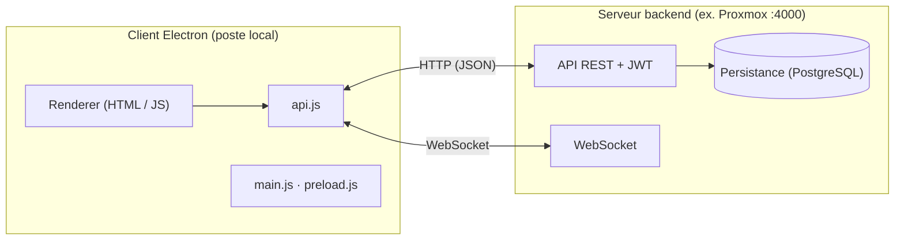


| Lien          | Contenu typique                                                    |
| ------------- | ------------------------------------------------------------------ |
| **HTTP**      | CRUD métier, auth, fichiers, PDF, raccourcis utilisateur, etc.     |
| **WebSocket** | Temps réel (ex. chat), notifications selon implémentation serveur. |


### 2.3 Arborescence indicative (client + racine)

```
workspace/
├── apps/client/                    # Application Electron
│   ├── main.js, preload.js, package.json
│   ├── config/connection.json      # URL serveur et endpoints (miroir : public/config/)
│   ├── lib/                        # electron-updater, découverte client
│   ├── build/, assets/             # Icônes et ressources pour les installeurs
│   └── public/                     # Interface (renderer)
│       ├── index.html, app.js
│       ├── pages/, reception-pages/
│       ├── components/             # header, footer, modales, chat…
│       ├── assets/css/, assets/js/
│       │   ├── config/             # api.js, AppConfig, logs, erreurs…
│       │   └── modules/            # agenda, auth, chat, dossier, réception…
│       ├── pdf-templates/, lib/    # Font Awesome local
│       └── src/                    # Icônes, PDF statiques embarqués
├── docs/                           # JWT, Electron, API raccourcis…
├── proxmox/app/                    # Backend (branche proxmox) + README dédié
├── scripts/                        # env, auto-update, install npm
├── .github/workflows/              # CI → build client, Releases
└── package.json                    # Monorepo npm workspaces
```

Les répertoires `node_modules/`, `apps/client/dist/`, `apps/client/out/`, `coverage/`, `data/` sont en général **hors Git** (voir `.gitignore`). **Stack client :** Node.js ≥ 18, Electron, JavaScript renderer, `electron-builder`.

---

## 3. Cybersécurité

### 3.1 Mesures en place (client)

- **CSP** (Content Security Policy) dans `public/index.html` : limitation des origines scripts, styles et connexions (y compris `ws:` / `wss:` pour le temps réel).
- **JWT** : requêtes signées par le module API ; gestion de session côté renderer.
- **Electron** : `nodeIntegration: false`, `contextIsolation: true`, exposition contrôlée via `preload.js` / `contextBridge`.
- **Chat** : modules de sécurité dédiés (configuration + gestionnaire) en complément du WebSocket authentifié.
- **CI** : publication des binaires avec secrets (`GH_TOKEN` / `GITHUB_TOKEN`), jamais de token en clair dans le dépôt.

---

## 4. Méthode de déploiement

### 4.1 Client (postes utilisateurs)


| Étape            | Détail                                                                                                                                                                                                                                 |
| ---------------- | -------------------------------------------------------------------------------------------------------------------------------------------------------------------------------------------------------------------------------------- |
| **Artefacts**    | AppImage / deb (Linux), NSIS ou portable (Windows), DMG (macOS), produits par **electron-builder** dans `apps/client/dist/`.                                                                                                           |
| **Build local**  | À la racine : `npm run build:linux` ou `npm run build:prod:linux:local` (build production **sans** pousser une Release). Aucun token requis.                                                                                           |
| **Mises à jour** | **electron-updater** interroge les **GitHub Releases** ; notification utilisateur si une version plus récente existe.                                                                                                                  |
| **CI/CD**        | Workflow [.github/workflows/build-client.yml](.github/workflows/build-client.yml) sur push `main` (fichiers sous `apps/client/`**, `package.json`, etc.) ou déclenchement manuel ; upload d’artefacts ; publication avec secret dépôt. |


### 4.2 Backend et environnement

Déploiement documenté sur la branche `**proxmox`** : `proxmox/docker/` (Docker Compose), `proxmox/docs/DEPLOYMENT.md`, [proxmox/app/README.md](proxmox/app/README.md). L’URL et le port (ex. `http://192.168.1.62:4000`) sont paramétrés dans `connection.json` côté client.

**Développement :** `npm ci` à la racine (Node ≥ 18) ; variables via `.env` / `scripts/run-with-env.js` et `.env.example` pour les builds publiant vers GitHub.

---

## 5. Ce que fait l’application

**Workspace** est le **point d’entrée unique** sur le poste : une application Electron regroupe les fonctions ci-dessous. La plupart des données métier transitent par le **backend** (agenda, réception, catalogue d’applications, raccourcis personnels, etc.). L’exploration de fichiers et certains exports peuvent s’appuyer sur des **chemins réseau** ou des fichiers locaux selon la configuration serveur.


| Module              | Rôle                                                                                                                                                                                                      |
| ------------------- | --------------------------------------------------------------------------------------------------------------------------------------------------------------------------------------------------------- |
| **Accueil**         | Tableau de bord : heure et date en direct, informations de la structure (ex. La Capsule).                                                                                                                 |
| **Agenda**          | Calendrier (vues semaine, mois, année) : création, modification et suppression d’événements **synchronisés avec le serveur**.                                                                             |
| **Réception**       | Espace **matériel reconditionné** : lots PC, disques shreddés, commandes, dons, puis inventaire, historique et traçabilité (détail ci-dessous).                                                           |
| **Dossier interne** | Accès aux **documents internes** par **entité**, via l’API et les chemins exposés par le serveur.                                                                                                         |
| **Applications**    | Liens ou lanceurs vers les **logiciels internes**, par **catégorie** (développement, streaming, bureautique, etc.) ; catalogue **fourni par le backend**.                                                 |
| **Raccourcis**      | **Liens personnels** de l’utilisateur connecté : catégories et entrées **stockées côté serveur** et filtrées par **compte** (JWT). Création, édition, réordonnancement et suppression depuis l’interface. |
| **Options**         | **Paramètres du compte** uniquement : modification du **pseudo**, du **mot de passe**, **suppression du compte** (zone sensible avec confirmation).                                                       |


### Réception (sections de l’interface)

**Lots et documents**

- **Lots** : saisie et gestion des **nouveaux lots** de machines (PC), numéros de série, marques, modèles.
- **Disques** : flux **disques shreddés** (sessions, liste des disques, PDF de certificat / traçabilité selon l’API).
- **Commande** : suivi des **commandes** matériel associées au flux réception.
- **Dons** : enregistrement et suivi des **dons** de matériel.

**Suivi et traçabilité**

- **Inventaire** : **lots en cours**, filtres par état, **assignation** aux techniciens.
- **Historique** : **lots terminés** et archives des mouvements.
- **Traçabilité** : **vue consolidée** reliant lots, disques, commandes et dons (selon données serveur), accès aux **PDF**, actions type envoi ou régénération selon configuration.

---
<details>
<summary><strong>Captures d’écran de l’interface</strong></summary>

| | |
| :---: | :---: |
| 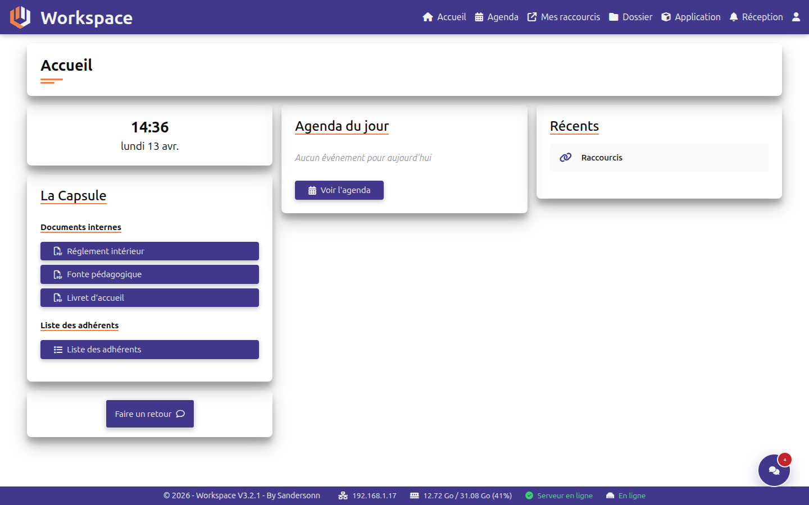<br>*Accueil* | 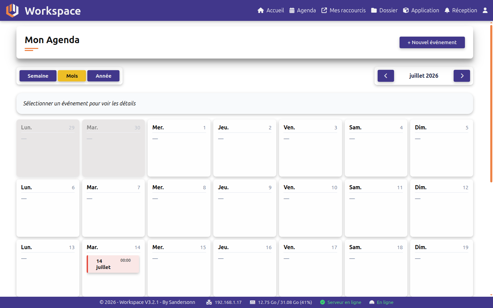<br>*Agenda* |
| 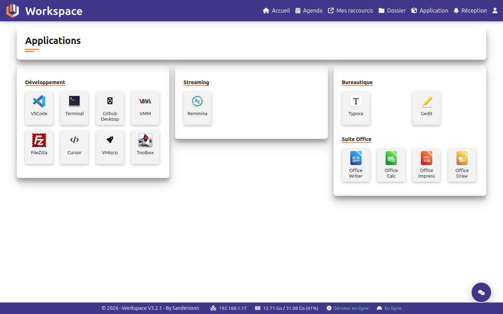<br>*Applications* | 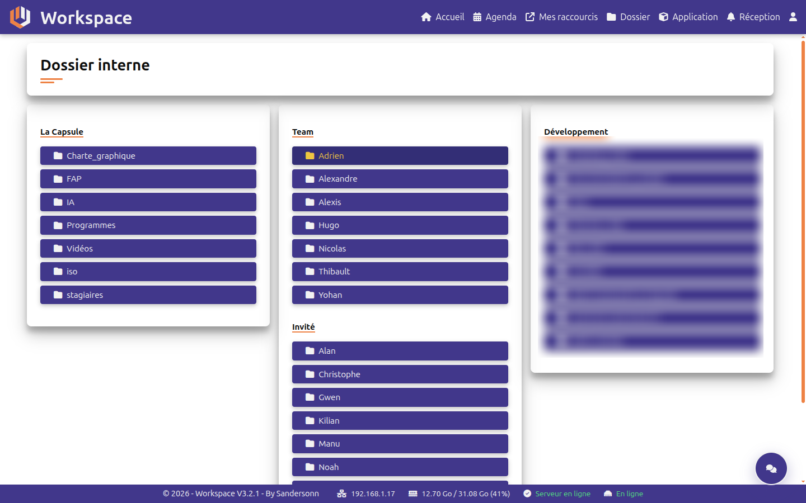<br>*Dossier interne* |
| 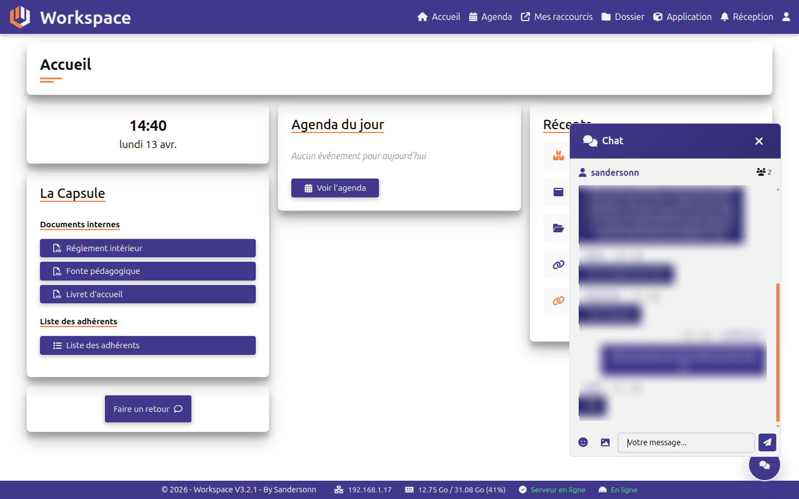<br>*Chat* | 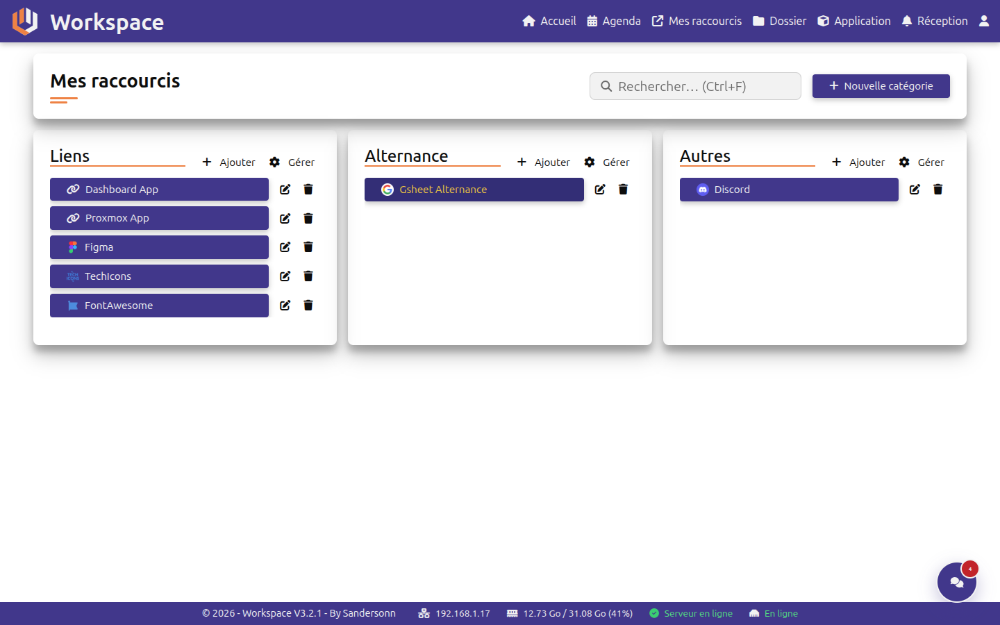<br>*Raccourcis connexion* |
| 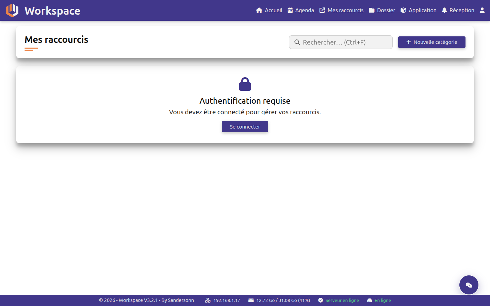<br>*Raccourcis déconnexion* | 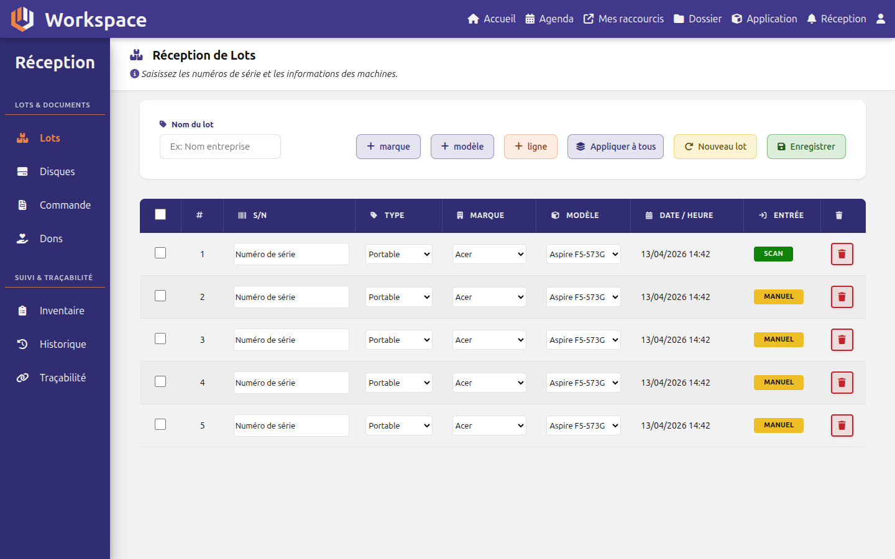<br>*Réception lots* |
| 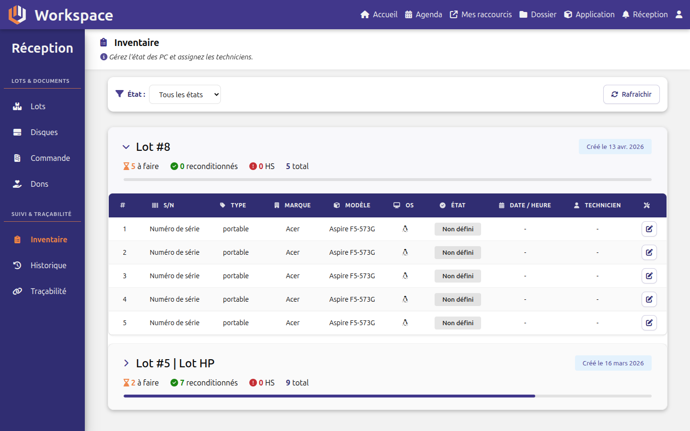<br>*Réception inventaire* | 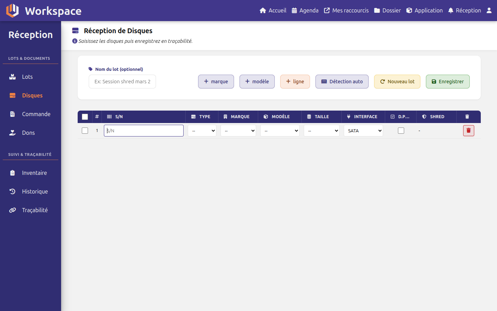<br>*Réception disques* |
| 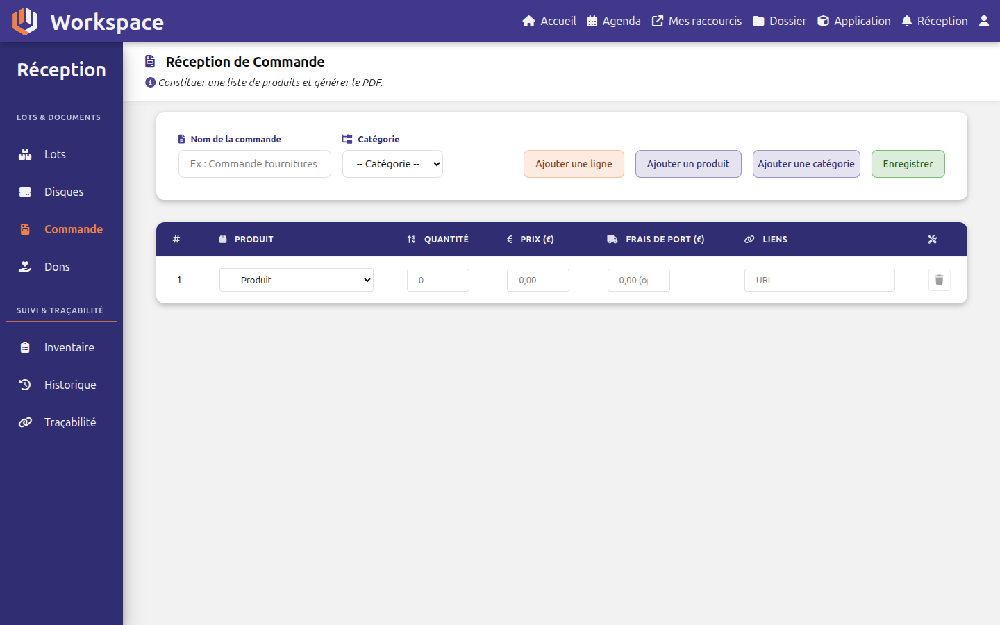<br>*Réception commande* | 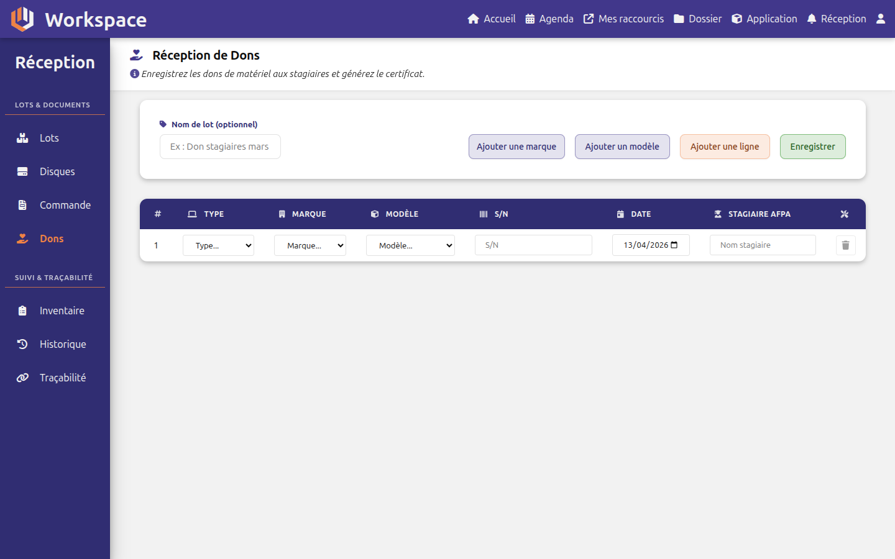<br>*Réception dons* |
| 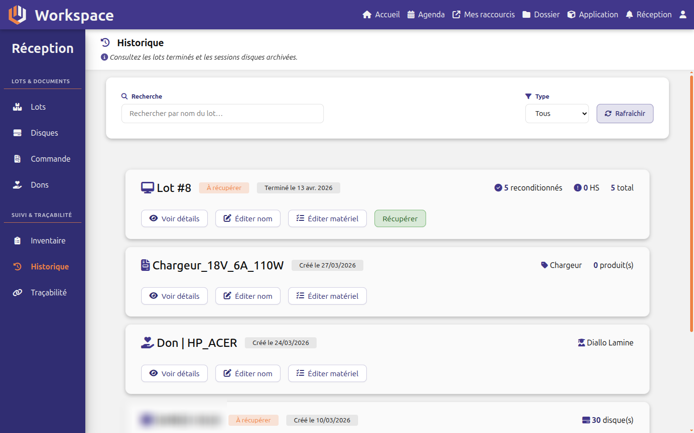<br>*Réception historique* | 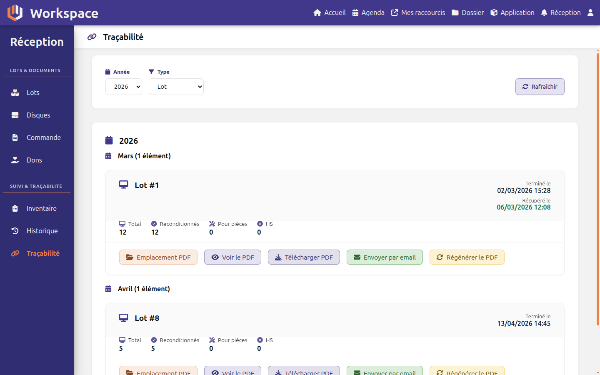<br>*Réception traçabilité* |
| 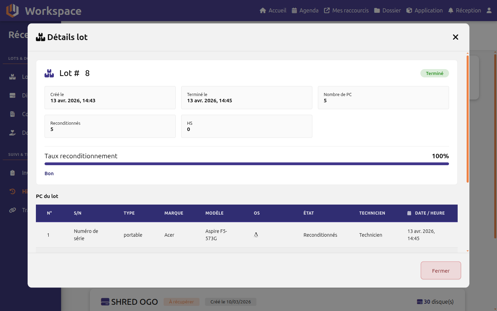<br>*Historique détail d’un lot* | 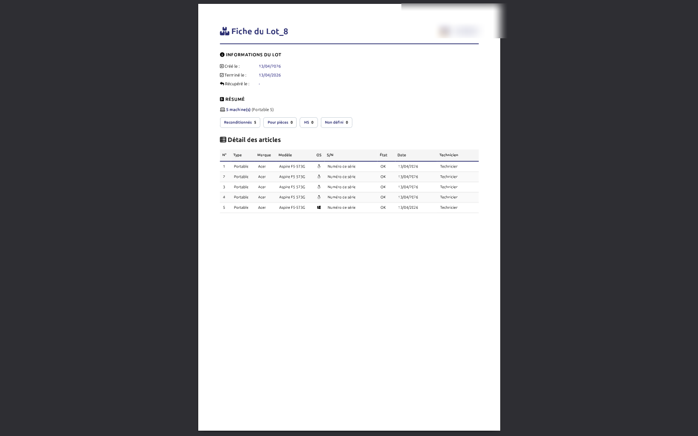<br>*PDF traçabilité (exemple)* |

</details>